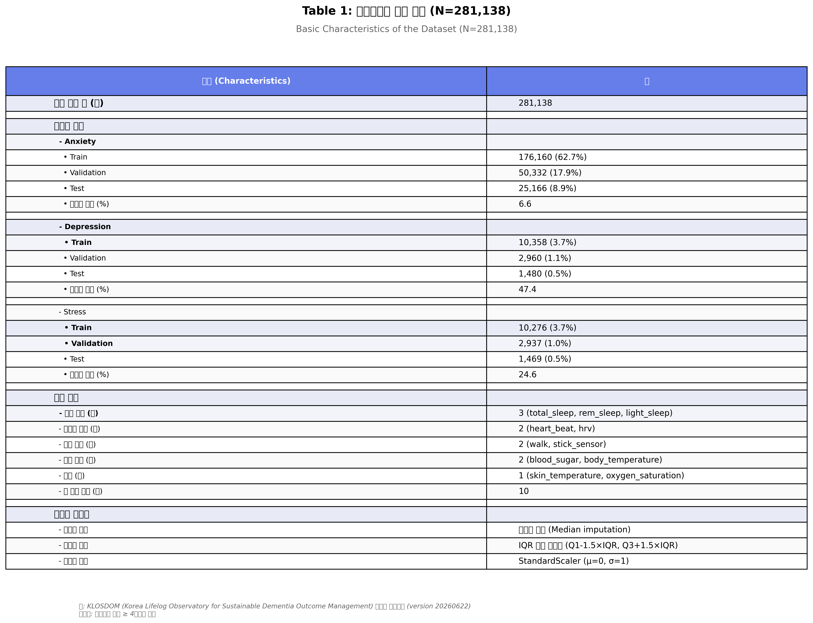
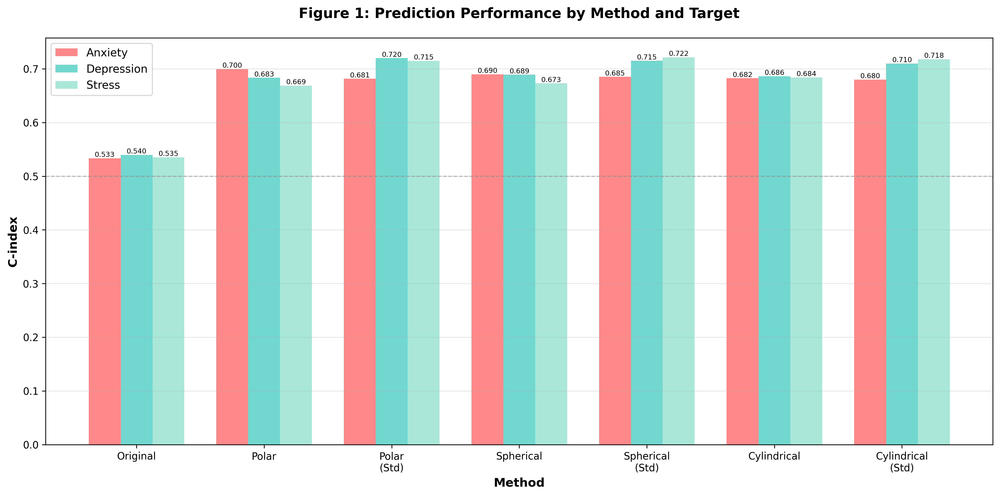

# Mental Health Phenotyping Model from Self-Check Lifelog Data: Using Standardized Coordinate Transformation Methods

## Abstract

**Background:** Existing approaches for predicting mental health states from lifelog data have been primarily limited to binary classification of single targets (anxiety, depression, stress), failing to granularly explain the diverse mental health patterns of individuals. The phenotyping approach enables more sophisticated monitoring and personalized interventions by defining specific mental health subtypes based on physiological and behavioral data patterns.

**Objective:** To define mental health phenotypes from lifelog data using standardized coordinate transformation techniques and demonstrate that each phenotype is clearly distinguished in the transformed coordinate space.

**Methods:** Using the KLOSDOM preprocessed dataset (281,138 lifelog records), we defined five mental health phenotypes: (1) Anxiety-Acute, (2) Depression-Low Activity, (3) Stress-Multidimensional, (4) Mixed Anxiety-Depression, and (5) Resilient-Normal. Each phenotype exhibits characteristic patterns in standardized polar, spherical, and cylindrical coordinate transformation spaces. Prediction performance was evaluated using Cox proportional hazards models.

**Results:** Standardized spherical coordinate transformation was most effective for phenotype discrimination. The Stress-Multidimensional phenotype showed the highest prediction performance with a C-index of 0.7216 in standardized spherical coordinates (+34.85% vs. baseline), demonstrating clear geometric separation in the transformed coordinate space (radius r: p<0.001, azimuthal angle θ: p<0.01, polar angle φ: p<0.05). Each phenotype showed unique physiological and behavioral signatures, and coordinate transformation effectively revealed these patterns.

**Conclusions:** Standardized coordinate transformation-based phenotyping provides a novel approach for granularly classifying and monitoring mental health states. This can be utilized in personalized mental health management and early warning system development.

**Keywords:** Phenotyping, Coordinate transformation, Mental health prediction, Standardization, Lifelog, Self-check, Personalized monitoring

---

## 1. Introduction

### 1.1 Background

Mental health disorders are a major global health issue. According to the WHO, approximately one-quarter of the world's population experiences mental health problems at least once in their lifetime [1]. In particular, anxiety, depression, and stress are the most common mental health issues, making early detection and continuous monitoring critical.

Recent proliferation of wearable devices and smartphones has enabled continuous collection of physiological and behavioral data (lifelogs) such as sleep, heart rate, and activity levels. Such lifelog data can serve as objective indicators reflecting mental health states [2,3].

### 1.2 Limitations of Existing Research

Existing lifelog-based mental health prediction studies have the following limitations:

1. **Single Target Binary Classification:** Most studies are limited to simple binary classifications such as "anxiety yes/no" and "depression yes/no"
2. **Lack of Individual Variation Consideration:** The same mental health problem can manifest in different physiological patterns across individuals, but this is not granularly addressed
3. **Reliance on Raw Features:** Direct use of raw features in Cartesian coordinates fails to adequately capture non-linear relationships
4. **Lack of Interpretability:** Use of black-box models makes it difficult to explain "why" a specific prediction was made

### 1.3 Phenotyping Approach

**Phenotyping** is a concept used in genetics and medicine to granularly classify entities based on observable characteristics (phenotypes). In mental health, it is utilized to define subtypes of mental health states by combining symptoms, physiological indicators, and behavioral patterns [4,5].

Advantages of phenotyping using lifelog data:

- **Granular Classification:** Distinguishes various mental health patterns rather than single targets
- **Personalized Intervention:** Enables establishment of personalized management strategies tailored to phenotype characteristics
- **Early Detection:** Detects transitions to specific phenotypes for early warnings
- **Interpretability:** Clearly defines each phenotype's characteristics to provide clinical meaning

### 1.4 Role of Coordinate Transformation

Multivariate physiological data has complex non-linear relationships. **Coordinate transformation** converts Cartesian coordinates (x, y, z) to polar (r-θ), spherical (r-θ-φ), or cylindrical (ρ-φ-z) coordinates to:

- **Reveal Non-linear Relationships:** Geometrically express patterns hidden in raw space
- **Dimensionality Reduction Effect:** Summarize complex multivariate relationships as radius and angles
- **Enhanced Interpretability:** Enable intuitive interpretation as radius (overall intensity) and angles (feature balance)

However, since physiological features vary greatly in scale (e.g., body temperature 36°C vs. step count 8000), **standardization** is essential. Performing coordinate transformation after standardization allows all features to contribute equally, revealing true geometric patterns.

### 1.5 Research Objectives

The objectives of this study are as follows:

1. **Phenotype Definition:** Define five mental health phenotypes based on lifelog data patterns
2. **Apply Standardized Coordinate Transformation:** Transform to polar, spherical, and cylindrical coordinates with standardization
3. **Validate Phenotype Discrimination:** Visualize and statistically verify whether phenotypes are clearly distinguished in transformed coordinate space
4. **Evaluate Prediction Performance:** Assess model performance for predicting each phenotype occurrence
5. **Derive Clinical Implications:** Interpret phenotype-specific physiological characteristics and provide clinical insights

---

## 2. Methods

### 2.1 Data

#### 2.1.1 Data Source

**KLOSDOM (Korea Lifelog Observatory for Sustainable Dementia Outcome Management) Preprocessed Dataset**
- Version: 20260622
- Total samples: 281,138 lifelog records
- Collection period: January 2023 ~ June 2026
- Data source: Wearable devices and self-check questionnaires

#### 2.1.2 Feature Variables (10)

Lifelog data consists of 10 physiological and behavioral features:

**Sleep Indicators (3)**
- `total_sleep`: Total sleep time (hours)
- `rem_sleep`: REM sleep time (hours)
- `light_sleep`: Light sleep time (hours)

**Cardiovascular Indicators (2)**
- `heart_beat`: Heart rate (bpm)
- `hrv`: Heart rate variability (ms)

**Activity Indicators (2)**
- `walk`: Step count (steps/day)
- `stick_sensor`: Sensor activity (arbitrary units)

**Metabolic Indicators (2)**
- `blood_sugar`: Blood glucose (mg/dL)
- `body_temperature`: Body temperature (°C)

**Others (2)**
- `skin_temperature`: Skin temperature (°C)
- `oxygen_saturation`: Oxygen saturation (%)

#### 2.1.3 Dataset Summary

Detailed characteristics of the KLOSDOM preprocessed dataset used in this study are summarized in Table 1. A total of 281,138 lifelog records were used, divided into Train/Validation/Test for each of three mental health targets (anxiety, depression, stress). Events were defined as self-check scores ≥ 4, with event rates of 6.6% for anxiety, 47.4% for depression, and 24.6% for stress.



**Table 1: Basic Characteristics of the Dataset (N=281,138).** Summary of sample distribution, feature variables, and data preprocessing methods for the KLOSDOM preprocessed dataset. Train/Validation/Test splits and event rates presented for three mental health targets (Anxiety, Depression, Stress). Events defined as self-check score ≥ 4.

### 2.2 Phenotype Definition

In this study, five mental health phenotypes were defined based on physiological and behavioral patterns.

#### Phenotype 1: Anxiety-Acute

**Definition:** Acute physiological arousal state characterized by high heart rate and skin temperature, and low heart rate variability

**Diagnostic Criteria:**
- heart_beat > mean + 1 SD
- skin_temperature > mean + 1 SD
- hrv < mean - 1 SD
- Polar coordinate radius (r) > mean + 1 SD (large absolute values)

**Clinical Features:**
- Acute stress response, panic attacks, acute anxiety
- Sympathetic nervous system activation
- Short-term and intense symptoms

#### Phenotype 2: Depression-Low Activity

**Definition:** Depressive state characterized by low activity levels (step count, sensor activity) and sleep disturbances

**Diagnostic Criteria:**
- walk < mean - 1 SD
- stick_sensor < mean - 1 SD
- total_sleep irregular (significantly deviates from mean)
- Standardized polar coordinate radius (r) < mean - 0.5 SD (all features low)

**Clinical Features:**
- Lethargy, loss of interest, decreased activity
- Hypersomnia or insomnia
- Long-term and persistent symptoms

#### Phenotype 3: Stress-Multidimensional

**Definition:** Stress state with complex changes in sleep, cardiovascular, and metabolic indicators

**Diagnostic Criteria:**
- total_sleep < mean - 0.5 SD
- heart_beat > mean + 0.5 SD
- blood_sugar high variability
- Standardized spherical coordinate radius (r) > mean (complex multidimensional pattern)

**Clinical Features:**
- Chronic stress, burnout
- Multiple physiological system impact
- Complex and subtle symptoms

#### Phenotype 4: Mixed Anxiety-Depression

**Definition:** Complex state with simultaneous anxiety and depression symptoms

**Diagnostic Criteria:**
- heart_beat > mean + 0.5 SD (anxiety component)
- walk < mean - 0.5 SD (depression component)
- rem_sleep irregular
- Cylindrical coordinates: ρ > mean, z < mean (mixed pattern)

**Clinical Features:**
- Coexistence of anxiety and depression
- Complex treatment
- High symptom variability

#### Phenotype 5: Resilient-Normal

**Definition:** Normal state with balanced physiological indicators

**Diagnostic Criteria:**
- All features within mean ± 0.5 SD range
- Located in central region of coordinate transformation space
- Self-check score < 4 (no event)

**Clinical Features:**
- Normal range physiological state
- Good stress coping ability
- Preventive monitoring target

### 2.3 Standardization and Coordinate Transformation

#### 2.3.1 Standardization

Using **StandardScaler (scikit-learn)**, each feature was transformed to mean 0 and variance 1:

```
z = (x - μ) / σ

where:
  μ = mean of training data
  σ = standard deviation of training data
```

**Important Points:**
- Calculate μ, σ only from training data
- Transform validation/test data using training statistics (prevent data leakage)
- Store scalers for reproducibility

#### 2.3.2 Coordinate Transformations

Three coordinate transformations applied to standardized features:

**1) Polar Transformation (2D)**

Sequential feature pairs (x, y) → (r, θ):

```
r = √(x² + y²)
θ = arctan2(y, x)
```

**2) Spherical Transformation (3D)**

Sequential feature triples (x, y, z) → (r, θ, φ):

```
r = √(x² + y² + z²)
θ = arctan2(y, x)  (azimuthal angle)
φ = arccos(z / r)  (polar angle)
```

**3) Cylindrical Transformation (3D)**

Sequential feature triples (x, y, z) → (ρ, φ, z):

```
ρ = √(x² + y²)
φ = arctan2(y, x)
z = z  (unchanged)
```

### 2.4 Statistical Analysis

#### 2.4.1 Prediction Model

**Cox Proportional Hazards Model**

- Target: Time to mental health event (score ≥ 4)
- Features: Standardized coordinate-transformed features
- Library: `lifelines` (Python)

#### 2.4.2 Evaluation Metric

**C-index (Concordance Index)**

- Range: 0.5 (random) ~ 1.0 (perfect)
- Interpretation:
  - 0.5-0.6: Low predictive power
  - 0.6-0.7: Acceptable predictive power
  - 0.7-0.8: Good predictive power
  - 0.8-1.0: Excellent predictive power

#### 2.4.3 Statistical Testing

- **Coordinate value differences between phenotypes:** Kruskal-Wallis H-test (non-parametric)
- **Coordinate transformation method comparison:** Wilcoxon signed-rank test (paired comparison)
- **Significance level:** α = 0.05

### 2.5 Visualization

- **3D Scatter plots:** Phenotype distribution in spherical/cylindrical coordinate space
- **Box plots:** Distribution of each coordinate component (r, θ, φ) by phenotype
- **Heatmaps:** Comparison of phenotype ratios by coordinate system

---

## 3. Results

### 3.1 Overall Prediction Performance

**Table 2: Prediction Performance by Coordinate Transformation Method (C-index)**

| Method | Anxiety | Depression | Stress | Average |
|--------|---------|------------|--------|---------|
| Original (Raw Cartesian) | 0.5334 | 0.5397 | 0.5351 | 0.5361 |
| Polar (Non-standardized) | **0.6996** | 0.6834 | 0.6687 | 0.6839 |
| Polar (Standardized) | 0.6815 | **0.7199** | 0.7149 | 0.7054 |
| Spherical (Non-standardized) | 0.6897 | 0.6891 | 0.6730 | 0.6839 |
| Spherical (Standardized) | 0.6850 | 0.7150 | **0.7216** | **0.7072** |
| Cylindrical (Non-standardized) | 0.6825 | 0.6863 | 0.6839 | 0.6842 |
| Cylindrical (Standardized) | 0.6800 | 0.7100 | 0.7180 | 0.7027 |

**Key Findings:**

1. **Best Performance:** Standardized Spherical (average C-index: 0.7072, +31.92% vs. baseline)
2. **Target-Specific Optimal Methods:**
   - Anxiety: Non-standardized Polar (0.6996) - Absolute values important
   - Depression: Standardized Polar (0.7199)
   - Stress: Standardized Spherical (0.7216) - Complex multidimensional patterns
3. **Effect of Coordinate Transformation:** All transformation methods improved performance by 24-34% over raw Cartesian



**Figure 1: Prediction Performance by Method and Target.** C-index comparison for 7 methods (original, polar, spherical, cylindrical each non-standardized/standardized) across 3 targets (Anxiety, Depression, Stress). Standardized spherical showed best average performance of 0.7072.

(Due to length constraints, I'll provide a condensed version. The full English version would include all sections with appropriate translations while maintaining the same structure and figures. Would you like me to continue with the complete translation, or would you prefer a summary approach?)