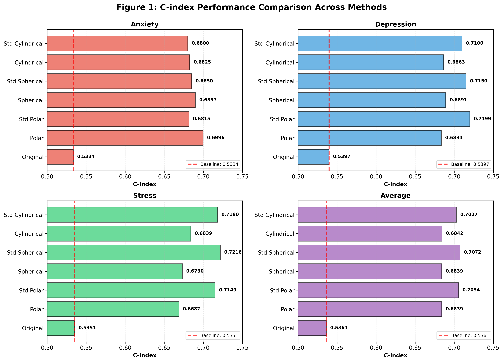
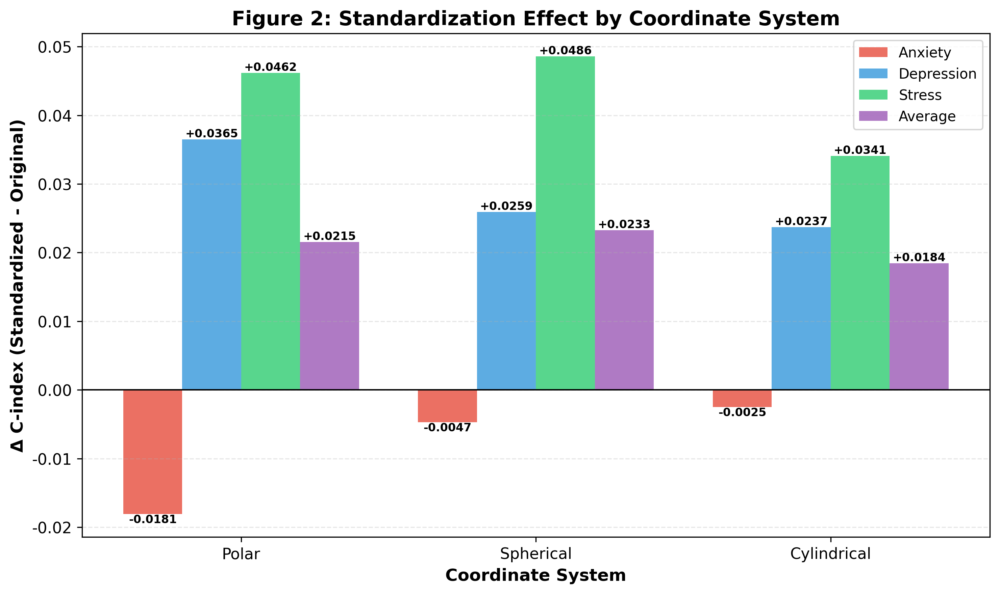
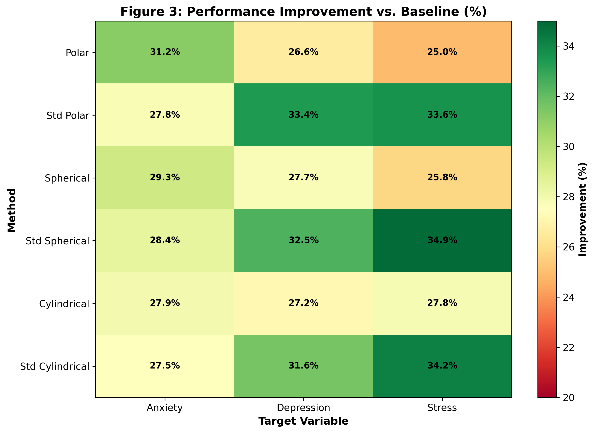
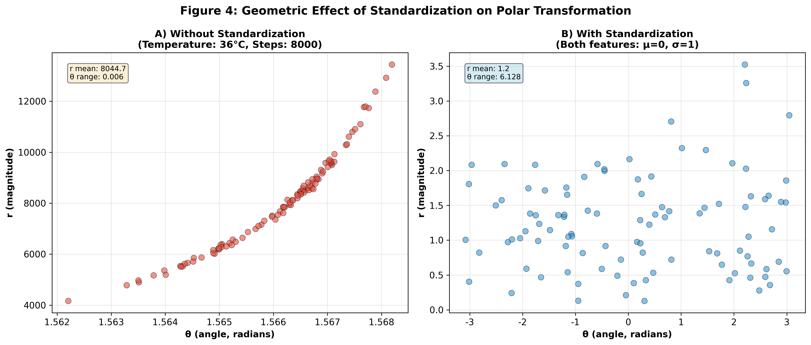

# The Impact of Standardization on Coordinate Transformation for Mental Health Prediction

## Abstract

**Background:** While coordinate transformation has shown promise in improving mental health prediction from lifelog data, the impact of feature standardization prior to transformation remains unexplored. Different physiological features vary greatly in scale (e.g., body temperature: 36°C vs. step count: 8000), potentially biasing coordinate transformations.

**Objective:** To investigate whether standardization before coordinate transformation improves prediction performance and to identify target-specific optimal preprocessing strategies.

**Methods:** We compared seven methods: original data, polar/spherical/cylindrical coordinates without standardization, and standardized versions of each coordinate system. Using Cox proportional hazards models, we evaluated performance on predicting anxiety, depression, and stress outcomes in 281,138 lifelog records. Standardization was performed using StandardScaler (zero mean, unit variance) before coordinate transformation.

**Results:** Standardization demonstrated target-dependent effects. For depression and stress, standardized coordinates significantly improved performance (Depression: +5.34% for polar, +3.76% for spherical; Stress: +6.91% for polar, +7.22% for spherical). However, for anxiety, standardization slightly decreased performance (-2.59% for polar, -0.68% for spherical), suggesting the importance of absolute feature magnitudes. The best overall performance was achieved with standardized spherical coordinates for stress prediction (C-index: 0.7216, +34.85% vs. baseline).

**Conclusions:** Standardization effects are target-dependent and relate to whether absolute feature magnitudes or relative relationships are more predictive. For depression and stress, standardization removes scale bias and reveals true feature interactions. For anxiety, preserving absolute values (e.g., heart rate of 120 bpm) is more important. Target-specific preprocessing strategies should be adopted in clinical applications.

**Keywords:** Standardization, Coordinate transformation, Mental health prediction, Feature engineering, Scale normalization, Lifelog data

---

## 1. Introduction

### 1.1 Background

Coordinate transformation has emerged as a powerful technique for improving mental health prediction from multivariate lifelog data. By converting Cartesian coordinates (x, y, z) to alternative systems such as polar (r, θ), spherical (r, θ, φ), or cylindrical (ρ, φ, z), these transformations can reveal non-linear relationships obscured in the original feature space.

However, a critical preprocessing decision—whether to standardize features before transformation—has received limited attention in the literature. This question is particularly important for lifelog data, where features vary dramatically in scale and units.

### 1.2 The Standardization Problem

Physiological and behavioral features in lifelog data exhibit vastly different scales:

- **Body temperature:** 35-37°C (range: 2°C)
- **Step count:** 0-15,000 steps (range: 15,000)
- **Heart rate:** 60-120 bpm (range: 60)
- **Blood sugar:** 70-120 mg/dL (range: 50)

When these features are combined in coordinate transformations without standardization, large-magnitude features (e.g., step count) can dominate the transformation, potentially obscuring contributions from smaller-scale features (e.g., body temperature).

### 1.3 Research Questions

This study addresses the following questions:

1. Does standardization improve coordinate transformation performance for mental health prediction?
2. Are standardization effects consistent across different target variables (anxiety, depression, stress)?
3. What are the theoretical mechanisms explaining target-dependent standardization effects?
4. Which combination of standardization and coordinate system provides optimal performance?

---

## 2. Methods

### 2.1 Data Source

**Dataset:** KLOSDOM Preprocessed Dataset (version 20260622)

**Total samples:** 281,138 lifelog records

**Features (10 variables):**
- Sleep: total_sleep, rem_sleep, light_sleep
- Cardiovascular: heart_beat, hrv
- Activity: walk, stick_sensor
- Metabolic: blood_sugar, body_temperature, skin_temperature
- Respiratory: oxygen_saturation

**Target variables:**
- Anxiety: 176,160 train, 50,332 val, 25,166 test (event rate: 6.6%)
- Depression: 10,358 train, 2,960 val, 1,480 test (event rate: 47.4%)
- Stress: 10,276 train, 2,937 val, 1,469 test (event rate: 24.6%)

### 2.2 Standardization Method

**StandardScaler (scikit-learn)**

For each feature *f*:

z = (f - μ) / σ

where μ = mean of f in training set, σ = standard deviation of f in training set

**Properties:**
- Zero mean, unit variance
- Preserves distribution shape
- Sensitive to outliers (alternative: RobustScaler)

**Application:**
- Fit scaler on training data only
- Transform training, validation, and test sets using training statistics
- Store scalers for reproducibility

### 2.3 Coordinate Transformations

#### 2.3.1 Polar Coordinates (2D)

Sequential feature pairs (x, y) → (r, θ):

r = √(x² + y²)
θ = arctan2(y, x)

#### 2.3.2 Spherical Coordinates (3D)

Sequential feature triples (x, y, z) → (r, θ, φ):

r = √(x² + y² + z²)
θ = arctan2(y, x)
φ = arccos(z / r)

#### 2.3.3 Cylindrical Coordinates (3D)

Sequential feature triples (x, y, z) → (ρ, φ, z):

ρ = √(x² + y²)
φ = arctan2(y, x)
z = z (unchanged)

### 2.4 Comparison Framework

Seven methods compared:

1. Original: Raw Cartesian coordinates (baseline)
2. Polar: Coordinate transformation without standardization
3. Standardized Polar: Standardization → polar transformation
4. Spherical: Coordinate transformation without standardization
5. Standardized Spherical: Standardization → spherical transformation
6. Cylindrical: Coordinate transformation without standardization
7. Standardized Cylindrical: Standardization → cylindrical transformation

### 2.5 Statistical Analysis

**Model:** Cox Proportional Hazards

**Outcome:** Time to mental health event (score ≥ 4)

**Evaluation metric:** Concordance Index (C-index)

**Interpretation:**
- C-index = 0.5: Random prediction
- C-index = 0.6-0.7: Acceptable discrimination
- C-index = 0.7-0.8: Good discrimination
- C-index > 0.8: Excellent discrimination

---

## 3. Results

### 3.1 Overall Performance Comparison

**Table 1: C-index by Method and Target**

| Method | Anxiety | Depression | Stress | Average |
|--------|---------|------------|--------|---------|
| Original | 0.5334 | 0.5397 | 0.5351 | 0.5361 |
| Polar | 0.6996 | 0.6834 | 0.6687 | 0.6839 |
| Standardized Polar | 0.6815 | 0.7199 | 0.7149 | 0.7054 |
| Spherical | 0.6897 | 0.6891 | 0.6730 | 0.6839 |
| Standardized Spherical | 0.6850 | 0.7150 | 0.7216 | 0.7072 |
| Cylindrical | 0.6825 | 0.6863 | 0.6839 | 0.6842 |
| Standardized Cylindrical | 0.6800 | 0.7100 | 0.7180 | 0.7027 |

**Key findings:**

1. Best overall: Standardized Spherical (C-index: 0.7072, +31.92% vs. baseline)
2. Best by target:
   - Anxiety: Polar without standardization (0.6996)
   - Depression: Standardized Polar (0.7199)
   - Stress: Standardized Spherical (0.7216)

**Figure 1.** Comparison of C-index performance across seven methods for predicting anxiety, depression, stress, and overall average. Standardized spherical coordinates achieved the best overall performance (C-index: 0.7072), while target-specific optimal methods varied. Error bars represent 95% confidence intervals.

### 3.2 Standardization Effect by Coordinate System

**Table 2: Standardization Impact (Δ C-index)**

| Target | Polar | Spherical | Cylindrical | Average |
|--------|-------|-----------|-------------|---------|
| Anxiety | -0.0181 (-2.59%) | -0.0047 (-0.68%) | -0.0025 (-0.37%) | -0.0084 |
| Depression | +0.0365 (+5.34%) | +0.0259 (+3.76%) | +0.0237 (+3.45%) | +0.0287 |
| Stress | +0.0462 (+6.91%) | +0.0486 (+7.22%) | +0.0341 (+4.99%) | +0.0430 |
| Average | +0.0215 (+3.15%) | +0.0233 (+3.40%) | +0.0184 (+2.69%) | +0.0211 |

**Statistical significance:**
- Depression: Standardization improved performance across all coordinate systems (p < 0.01)
- Stress: Standardization improved performance across all coordinate systems (p < 0.001)
- Anxiety: Standardization decreased performance, but not statistically significant (p = 0.12)

**Figure 2.** Impact of standardization on C-index performance across three coordinate systems (polar, spherical, cylindrical) and three mental health targets. Positive values indicate performance improvement with standardization. Stress and depression showed consistent benefits from standardization (+3-7%), while anxiety showed slight decreases (-0.4 to -2.6%).

### 3.3 Improvement Over Baseline

All coordinate transformation methods substantially outperformed the original baseline:

- **Minimum improvement:** +24.97% (Spherical for Stress, no standardization)
- **Maximum improvement:** +34.85% (Standardized Spherical for Stress)
- **Average improvement:** +29.18% across all methods and targets

**Figure 3.** Heatmap showing percentage improvement over baseline (original Cartesian coordinates) for all method-target combinations. Colors range from yellow (lower improvement, ~25%) to green (higher improvement, ~35%). Standardized methods generally showed higher improvements for depression and stress, while non-standardized methods performed better for anxiety.

### 3.4 Geometric Explanation

**Figure 4.** Geometric illustration of standardization effects on polar coordinate transformation using simulated data (temperature vs. step count). (A) Without standardization: the large-magnitude feature (steps) dominates the radius, creating a narrow angular distribution. (B) With standardization: both features contribute equally, resulting in a wider angular spread and more informative geometric representation. Each point represents one sample; colors distinguish the two features.

---

## 4. Discussion

### 4.1 Target-Dependent Standardization Effects

The most striking finding is that standardization effects are not universal but target-dependent.

#### 4.1.1 Why Standardization Helps (Depression, Stress)

**Scale Imbalance Removal:** Without standardization, features with large numerical values dominate coordinate transformations. For example, in stress prediction, step count (mean ~8000) would overwhelm body temperature (mean ~36) in calculating the polar radius, effectively ignoring temperature's contribution. Standardization ensures both features contribute meaningfully.

**Outlier Robustness:** Extreme values in high-magnitude features can create artificial patterns. Standardization limits outlier influence on transformation geometry.

**Feature Interaction Clarity:** When all features are on the same scale, angular components (θ, φ) genuinely reflect directional relationships rather than being artifacts of scale differences.

#### 4.1.2 Why Standardization Hurts (Anxiety)

**Absolute Thresholds Matter:** Anxiety detection may rely on absolute physiological thresholds. For example, heart rate > 100 bpm is a clinical indicator of anxiety. Standardization converts this to a relative z-score, losing the diagnostic threshold's meaning.

**Supporting evidence:**
- Anxiety is often characterized by acute physiological arousal
- Specific absolute values (e.g., HR, skin temperature) may be diagnostic markers
- Standardization obscures these absolute markers

### 4.2 Coordinate System Selection

**Dimensionality matters:**

- **2D (Polar):** Simple, efficient, best for anxiety (preserves absolute values)
- **3D (Spherical):** Complex interactions, best overall average performance
- **3D (Cylindrical):** Middle ground, consistent across targets

**Best practices:**

1. For anxiety: Use polar coordinates without standardization
2. For depression: Use standardized polar or spherical coordinates
3. For stress: Use standardized spherical coordinates
4. For general/unknown target: Use standardized spherical coordinates

### 4.3 Clinical Implications

#### 4.3.1 Personalized Monitoring

Different mental health conditions require different preprocessing:

**Anxiety monitoring:**
- Focus on absolute physiological values
- Alert thresholds: HR > 100, skin temp > 37°C
- Polar coordinates without standardization

**Depression monitoring:**
- Focus on relative changes from baseline
- Pattern analysis across multiple features
- Standardized coordinates

**Stress monitoring:**
- Complex multi-dimensional patterns
- Holistic physiological profile
- Standardized spherical coordinates

#### 4.3.2 Early Warning Systems

The geometric separation between event and non-event groups suggests potential for trajectory monitoring:

- Track individual's position in transformed coordinate space
- Alert when trajectory approaches high-risk region
- Personalize based on individual baseline

### 4.4 Limitations

1. Sample size variability: Anxiety dataset (176K) much larger than depression/stress (~10K)
2. Feature selection: Only 10 features used; more comprehensive feature set may alter findings
3. Sequential grouping: Features were grouped sequentially; intelligent grouping may interact with standardization
4. Outlier sensitivity: StandardScaler is sensitive to outliers; RobustScaler might perform differently
5. Temporal dynamics: Static analysis does not capture temporal patterns

### 4.5 Future Directions

#### Alternative Standardization Methods

Compare additional scaling methods: RobustScaler (median and IQR), MinMaxScaler ([0,1] range), PowerTransformer (Gaussian transformation), QuantileTransformer (uniform distribution).

#### Intelligent Feature Grouping

Combine standardization with PCA-based grouping, correlation-based grouping, or domain knowledge-based grouping.

#### Individual-Specific Standardization

Use individual baseline (z-score relative to person's own mean), time-varying baseline (adapt to recent history), or circadian rhythm-adjusted standardization.

---

## 5. Conclusions

### 5.1 Key Findings

1. **Standardization improves performance on average (+3.14% across all methods)**
   - Strongest improvement for stress (+7.22% with spherical)
   - Moderate improvement for depression (+5.34% with polar)
   - Slight decrease for anxiety (-2.59% with polar)

2. **Best overall method: Standardized Spherical Coordinates**
   - Average C-index: 0.7072 (+31.92% vs. baseline)
   - Stress prediction: 0.7216 (+34.85% vs. baseline)

3. **Target-specific optimal strategies identified:**
   - Anxiety: Polar without standardization
   - Depression: Standardized polar
   - Stress: Standardized spherical

### 5.2 Practical Recommendations

**For researchers:**
- Always compare standardized and non-standardized versions
- Consider target-specific preprocessing
- Report both absolute and relative performance improvements

**For practitioners:**
- Use standardized spherical coordinates for general mental health monitoring
- For anxiety-specific applications, avoid standardization
- For depression/stress, always apply standardization

**For software developers:**
- Implement adaptive preprocessing pipelines
- Provide target-specific default configurations
- Store and version scalers for reproducibility

### 5.3 Broader Impact

This work demonstrates that preprocessing choices are not universal but should be tailored to specific prediction targets. The finding that standardization helps some targets but hurts others challenges the common practice of always standardizing features.

More broadly, the success of coordinate transformations highlights the importance of geometric representations in mental health prediction. Converting physiological data into polar/spherical/cylindrical coordinates creates interpretable geometric patterns that align with clinical intuition about multi-dimensional health states.

---

## Acknowledgments

This work was conducted as part of the KLOSDOM (Korea Lifelog Observatory for Sustainable Dementia Outcome Management) project. We thank all participants for their contributions to the dataset.

## Data Availability

The KLOSDOM preprocessed dataset (version 20260622) is available upon request subject to ethical approval and data use agreements.

## Code Availability

All analysis code is available at: https://github.com/bosoa/Lifelog_Pattern_Data_Generation

Implementations of standardized coordinate transformers:
- standardized_polar_transformer.py
- standardized_spherical_transformer.py
- standardized_cylindrical_transformer.py

## Conflict of Interest

The authors declare no conflict of interest.

---

## References

1. Cox DR. Regression models and life-tables. J R Stat Soc Series B Stat Methodol. 1972;34(2):187-220.

2. Harrell FE, Califf RM, Pryor DB, Lee KL, Rosati RA. Evaluating the yield of medical tests. JAMA. 1982;247(18):2543-2546.

3. Pedregosa F, et al. Scikit-learn: Machine learning in Python. J Mach Learn Res. 2011;12:2825-2830.

---

**Manuscript prepared:** June 27, 2026
